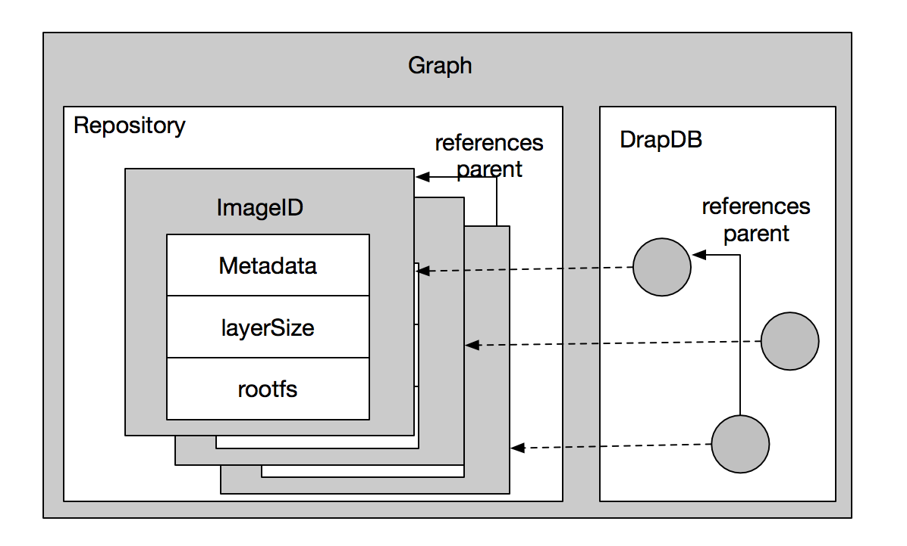

# Docker架构及功能模块

[TOC]

### 模块介绍

架构中主要模块:

- Docker Client
- Docker Daemon
- Docker Registry
- Graph
- Driver
- libcontainer
- Docker Container

#### 1.DockerClient

Docker Client是用户与Docker Daemon建立通信，通过docker命令行工具可以发起众多管理container的请求,docker daemon接受并处理请求

#### 2.docker daemon

Docker Daemon作为Docker架构中的主体部分，提供Server的功能接受Docker Client的请求,docker daemon的架构可以分为：

- docker server
- engine
- job

##### 2.1.docker server

server负责接收Docker Client发送的请求,通过路由与分发调度,找到相应的handle来处理请求;Dokcer Server通过包mux创建了一个mux.Router路由器提供路由功能

##### 2.2.engine

engine是Docker架构中的运行引擎,存储大量的容器信息,管理Dockcer大部分的Job的执行,Docker中大部分的任务通过engine匹配到相应的Job完成Job的执行

##### 2.3.job

job是Docker架构中engine内部最基本的工作执行单元;Docker可以做的每一项工作,都可以抽象为一个job,job有名称、参数、环境变量、标准的输入输出、错误处理、返回状态等

#### 3.Docker Registry

Docker Registry是一个存储容器镜像的仓库;而容器镜像是在容器被创建时,被加载用来初始化容器的文件架构与目录,Docker Daemon会与Docker Registry通信，实现搜索镜像、下载镜像、上传镜,对应的job为"search","pull" 与"push"

#### 4.Graph

Graph在Docker架构中是镜像的保管者,以及已下载容器镜像之间关系的记录者,包含两部分:

1. Repository保管镜像包括Docker下载、创建的镜像,同一类型的镜像被称为一个repository,同一个repository会因版本不同tag差异而不同
2. GraphDB记录着所有文件系统镜像彼此之间的关系

#### 5.Driver 

Driver是Docker架构中的驱动模块;通过Driver驱动,Docker可以实现对Docker容器执行环境的定制;Graph负责镜像的存储,Driver负责容器的执行,Driver层驱动来接管关于Docker运行信息的获取,Graph的存储与记录等这部分请求,在Docker Driver的实现中，可以分为以下三类驱动：

- graphdriver
- networkdriver
- execdriver

##### 5.1.graphdriver

- graphdriver主要用于完成容器镜像的管理，包括存储与获取
- 存储:docker pull下载的镜像由graphdriver存储到本地的指定目录Graph中
- 获取:docker run/create 用镜像来创建容器的时候由graphdriver到本地Graph中获取镜像

##### 5.2.networkdriver

networkdriver的用途是完成Docker容器网络环境的配置,其中包括

- Docker启动时为Docker环境创建网桥；
- Docker容器创建时为其创建专属虚拟网卡设备；
- Docker容器分配IP、端口并与宿主机做端口映射,设置容器防火墙策略等

##### 5.3.execdriver

- execdriver作为Docker容器的执行驱动，负责创建容器运行命名空间，负责容器资源使用的统计与限制，负责容器内部进程的真正运行等
- 现在execdriver默认使用native驱动,不依赖于LXC

#### 6.libcontainer 

- libcontainer是Docker架构中一个使用Go语言设计实现的库,使用该库可以不依靠任何依赖,直接访问内核中与容器相关的API
- Docker可以直接调用libcontainer,而最终操纵容器的namespace、cgroups、apparmor、网络设备以及防火墙规则等
- libcontainer提供了一整套标准的接口来满足上层对容器管理的需求

#### 7.Docker Container 

- Docker container(Docker容器)是Docker架构中服务交付的最终体现形式
- Docker按照用户的需求与指令,订制相应的Docker容器:
  - 用户通过指定容器镜像,使得Docker容器可以自定义rootfs等文件系统;
  - 用户通过指定计算资源的配额,使得Docker容器使用指定的计算资源;
  - 用户通过配置网络及其安全策略,使得Docker容器拥有独立且安全的网络环境;
  - 用户通过指定运行的命令,使得Docker容器执行指定的工作

### Docker运行分析

#### 1.docker pull

图中有编号的箭头表示docker pull命令在发起后,Docker架构中相应模块做的一系列操作:

1. Docker Client处理用户发起的docker pull命令,解析完请求以及参数之后,发送一个http请求给Docker Server,http请求的方式为post,请求的url为"images/create?"+"xxx",实际意义为下载相应镜像 
2. Docker Server 接收以上http请求,交给mux.Router,mux.Router通过url以及请求方法类型来确定执行该请求的具体handle
3. mux.Router将请求路由分发至相应的handle,具体为PostImagesCreate
4. 在PostImagesCreate这个handle中,创建并初始化一个名为"pull"的Job,之后触发执行该Job
5. 名为"pull"的Job在执行过程中执行pullRepository操作,即从Docker Registry中下载一个或多个Docker镜像
6. 名为"pull"的Job将下载的Docker镜像交给graphdriver管理
7. graphdriver负责存储镜像,一方面将实际镜像存储至本地文件系统中,另一方面为镜像创建对象,由Docker Daemon统一管理

#### 2.docker run 

图中有编号的箭头表示docker run命令在发起后,Docker架构中相应模块做的一系列操作:

1. Docker Client处理用户发起的docker run命令,解析完请求以及参数之后,发送一个http请求给Docker Server,http请求的方式为post,请求的url为"container/create?"+"xxx",实际意义为创建一个容器,即Docker Daemon中逻辑容器对象
2. Docker Server 接收以上http请求,交给mux.Router,mux.Router通过url以及请求方法类型来确定执行该请求的具体handle 
3. mux.Router将请求路由分发至相应的handle,具体为PostContainersCreate
4. 在PostContainersCreate这个handle中,创建并初始化一个名为"pull"的Job,之后触发执行该Job
5. 名为"create"的Job在执行过程中执行Container.Create操作,该操作需要获取容器镜像来为Docker容器准备rootfs,通过graphdriver完成
6. graphdriver从Graph中获取创建Docker容器rootfs所需的所有镜像
7. graphdriver将rootfs所有镜像通过某种联合文件系统的方式加载至Docker容器指定的文件目录下
8. 若以上操作全部正常完成,没有返回错误或异常,则Docker Client收到Docker Server返回状态之后,发起第二次http请求;请求方式为post,请求url为"/container/"+containerID+"/start",实际意义为启动刚才创建的容器对象,实现物理容器的真正运行
9. Docker Server接收以上http请求,交给mux.Router,mux.Router通过url以及请求方法类型来确定执行该请求的具体handle 
10. mux.Router将请求路由分发至相应的handle,具体为PostContainersStart
11. 在PostContainersStart这个handle中,创建并初始化一个名为"start"的Job,之后触发执行该Job
12. 名为"start"的Job执行需要完成一系列与Docker容器配置相关的工作,其中之一是为Docker容器网络环境分配网络资源,如IP资源等,通过调用networkerdriver完成
13. networkerdriver为指定的Docker容器分配网络资源,其中有ip、port等,另外为容器设置防火墙规则
14. 返回名为"start"的Job,执行完一些辅助性的操作后,Job开始执行用户命令,调用execdriver
15. execdriver被调用开始初始化Docker容器内部的运行环境,如命名空间、资源控制与隔离,以及用户命令的执行,相应的操作转交至libcontainer完成
16. libcontainer被调用,完成Docker容器内部运行环境初始化,并最终执行用户要求启动的命令

